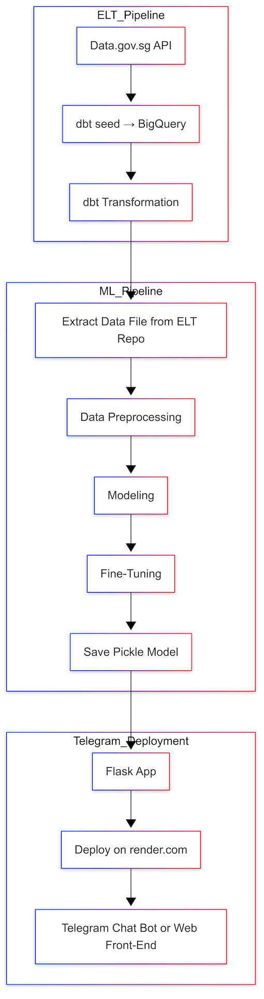

# HDB Resale Price Prediction – End‑to‑End ML Pipeline

> **Status:** Proof‑of‑Concept (0.1.x)

This repository is the **canonical documentation hub** for the multi‑repo project that delivers an end‑to‑end machine‑learning pipeline predicting Singapore HDB resale prices.

---

## Table of Contents
1. [Project Goal](#project-goal)
2. [Architecture](#architecture)
3. [Repository Map](#repository-map)
4. [Versioning & Release Policy](#versioning--release-policy)
5. [Development Workflow](#development-workflow)
6. [Roadmap](#roadmap)
7. [References](#references)

---

## Project Goal
The goal of this project is to **showcase a machine learning engineer can deliver a production‑grade, end‑to‑end machine‑learning system for predicting Singapore HDB resale flat prices** – starting from the public dataset on data.gov.sg through to a live inference service exposed via web UI and (eventually) chat‑bot.  

Success will be measured by:
* **Prediction accuracy** – baseline MAE ≤ \$45 k; stretch goal ≤ \$30 k on the 2024‑2025 hold‑out set.  
* **Operational reliability** – automated CI/CD pipeline with ≥ 90 % unit‑/integration‑test coverage and ≤ 1‑hour mean‑time‑to‑recover from failed deploys.  
* **Reproducibility** – every model artefact and dataset version traceable via Git tag + MLflow run ID.  
* **Stakeholder utility** – UX that lets a non‑technical user obtain a price estimate in under 10 seconds.

## Architecture
The platform is deliberately simple, cloud‑native, and pay‑as‑you‑go, favouring managed services over self‑hosted infra at this PoC stage.

| Layer | Key Components | Flow |
|-------|----------------|------|
| **Data Source** | Open dataset – HDB Resale Flat Prices (data.gov.sg) | CSV downloaded nightly |
| **ELT** | Meltano → BigQuery  
(db""t core for modelling) | Raw CSV → *raw* dataset → dbt seeds/models → *mart* views |
| **ML Experimentation** | Python, Pandas/Polars, scikit‑learn, Optuna  | Read *mart* views → EDA notebook → feature store (future) |
| **Model Registry** | MLflow tracking & registry (to be added) | Each experiment logged; best model promoted to **Staging** / **Production** rigorously |
| **Serving** | FastAPI (replacing Flask) deployed on Render.com | Loads production model, exposes `/predict` REST endpoint |
| **Presentation** | HTML + HTMX web form (now) → Looker Studio / Tableau dashboard (future) | End‑users, ops dashboards, BI analysts |
| **Orchestration / CI** | GitHub Actions (today) → Dagster (future) | Code lint + tests, Meltano ELT, dbt run, model train, deploy |

*(Detailed swim‑lane diagram lives in `/docs/architecture.md` – WIP)*

## Versioning & Release Policy
**Semantic Versioning 2.0.0** is applied repo‑wide. The docs repo maintains an umbrella compatibility matrix so that anyone can check which component versions are known‑good together.

| Rule | Why |
|------|-----|
| `MAJOR` – breaking data‑schema or API change | Signals required coordinated deploy across repos |
| `MINOR` – backward‑compatible feature | Enables incremental rollout without blocking others |
| `PATCH` – bug fix or doc‑only change | Safe hot‑fix; no migration needed |

Additional conventions:
* **Conventional Commits** style (`feat:`, `fix:`, `docs:`) → feeds *Release Drafter* to auto‑generate release notes.
* Git tags are `vX.Y.Z`; pre‑releases use `vX.Y.Z-rc.N`.
* Each release triggers GitHub Actions that: 1) build & push Docker image (`ghcr.io/org/repo:X.Y.Z`), 2) publish artefacts (e.g. pickled model) to the tag, 3) update this README’s compatibility table via PR.
* Until schema & serving API stabilise we remain in **0.x.y**; bump to **1.0.0** once we freeze.

## Development Workflow
1. **Branching model** – trunk‑based; short‑lived `feat/…` branches, squash‑merged into `main`.  
2. **CI gates** – lint (ruff, black), unit tests, integration tests with BigQuery test dataset & stub model registry.  
3. **Preview deploy** – on PR open, GitHub Actions spins up ephemeral Render Preview Env using the candidate Docker image and posts URL in the PR.  
4. **Merge → `main`** – auto‑version bump (`cz bump`), tag a **release‑candidate** (`0.4.0-rc.0`), push artefacts, deploy to **staging** environment.  
5. **Smoke + contract tests** run against staging FastAPI; if green, a “Promote RC to GA” workflow retags → `v0.4.0`, deploys to **production**, and creates a docs PR updating badges and the compatibility table.  
6. **Rollback** – Render keeps the previous image; `gh workflow run rollback.yml --ref v0.3.2` will redeploy it in < 5 min.

*(See `/docs/ci-cd.md` for job‑by‑job details – to be drafted.)

## Roadmap (Confirmed)
High‑level diagram and narrative describing the ELT pipeline, ML experimentation, model registry, and serving layer. *(Diagram placeholder – see `/docs/architecture.md`)*

## Repository Map

| Repository | Purpose | Link |
|------------|---------|------|
| **Docs** | Master documentation (this repo) | https://github.com/mlnotes2718/hdb-resale-price-end-to-end-ml-project-docs |
| **ELT** | Data ingestion & dbt transforms | https://github.com/mlnotes2718/hdb-resale-price-e2e-elt |
| **ML** | Model training & registry | https://github.com/mlnotes2718/hdb-resale-price-e2e-ml |
| **Web /API** | Flask API & Render.com site | https://github.com/mlnotes2718/hdb-resale-price-e2e-web-flask |

> **Live demo:** https://hdb-resale-price-e2e-web-flask.onrender.com

## Versioning & Release Policy
* Semantic Versioning 2.0.0 across all repos.
* Conventional Commits drive automated changelogs via Release Drafter.
* Umbrella compatibility table maintained in this README.

## Development Workflow
Outline of branching model, CI/CD jobs, and promotion flow from *dev* → *staging* → *prod*. *(See `/docs/ci-cd.md` for details – to be drafted).* 

## Roadmap (Confirmed)

### ELT Pipeline
| Phase | Target Milestone | Details |
|-------|------------------|---------|
| **1** | Replace *dbt seed* with Meltano | Migrate seed tables into Meltano → BigQuery ingestion |

### ML Pipeline
| Phase | Target Milestone | Details |
|-------|------------------|---------|
| **1** | Production‑grade EDA | Publish robust data‑profiling reports |

---

## Parking Lot – Candidate Enhancements
> The items below are **not yet committed**; they remain in the backlog until promoted to the confirmed roadmap.

### ELT Pipeline – Candidate Phases
| Phase | Target Milestone | Details |
|-------|------------------|---------|
| **2** | Data‑model hardening | Review dimensions, add fact tables, extend dbt tests |
| **3** | BI integration | Evaluate Looker Studio / Tableau and connect to BigQuery |
| **4** | Self‑service exploration | Deploy chosen BI tool for end users |
| **5** | Orchestration upgrade | Introduce Dagster; retire GitHub Actions for data jobs |
| **6** | Data quality & drift | Great Expectations & statistical drift detectors |
| **7** | Feature Store | Integrate Feast for training/serving feature parity |
| **8** | Infrastructure‑as‑Code | Terraform / Pulumi for Dagster, BigQuery, GCP infra |
| **9** | Data lineage & catalog | Adopt OpenMetadata / Atlan for end‑to‑end lineage |

### ML Pipeline – Candidate Phases
| Phase | Target Milestone | Details |
|-------|------------------|---------|
| **2** | Model development | Train multiple algorithms; Optuna hyper‑parameter search |
| **3** | Advanced modelling | Quantile regression & neural network experimentation |
| **4** | Model management | MLflow tracking & live model monitoring |
| **5** | Drift‑triggered retrain | Automate retrain ticket on data/model drift |
| **6** | Responsible‑AI checks | Fairness, bias & explainability tests in CI |
| **7** | Model CI/CD rollout | Canary or blue‑green deployments with FastAPI router versions |

### Deployment & Serving – Candidate Phases
| Phase | Target Milestone | Details |
|-------|------------------|---------|
| **1** | Model health monitoring | Alert on performance degradation or schema change |
| **2** | Conversational interface | Launch Telegram bot delivering predictions |
| **3** | API framework upgrade | Replace Flask API with FastAPI (async, OpenAPI docs) |
| **4** | Micro‑services | Decompose FastAPI application into independently deployable prediction services |
| **5** | Container orchestration | Scale via Kubernetes or Render autoscale |
| **6** | Service mesh observability | OpenTelemetry tracing, Grafana dashboards |
| **7** | Prediction logging warehouse | Central store for request/response & model metadata |

### Cross‑Cutting Candidate Improvements
* Secrets management with Vault or GCP Secret Manager  
* SBOM & supply‑chain scanning in CI  
* Cost monitoring & optimisation dashboards  

---

## References
- https://medium.com/@hargobind/not-your-average-hdb-resale-price-predictor-a0ea0c1fa6c2
- https://wongcheefah.pythonanywhere.com/data_project/
